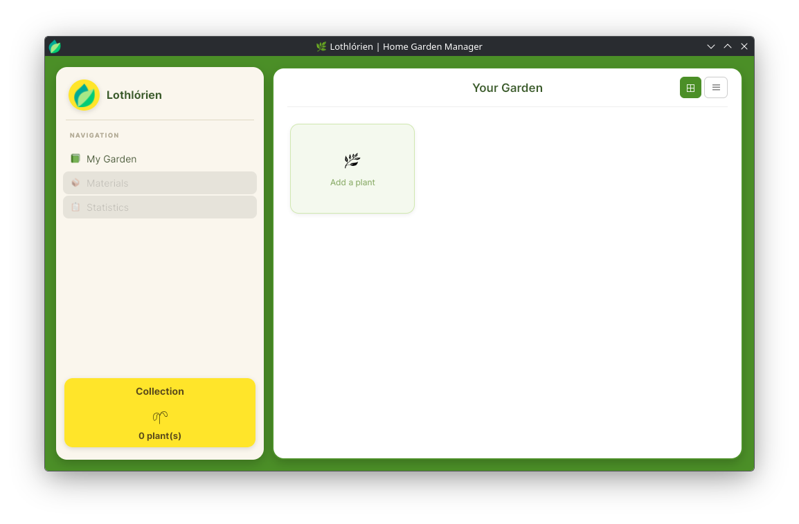
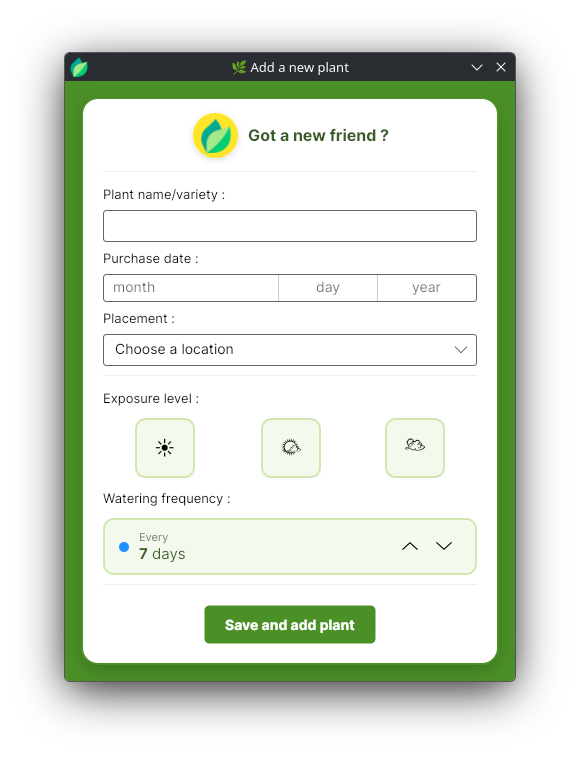

# 🌿 Lothlórien | Home Garden Manager

A desktop application built with **C#** and **Avalonia UI** to manage your own home garden.

## ✨ Features (goals)
- Add your plants and manage your garden inventory
- Manage your material inventory
- Keep track of the your plants watering frequency and health
- (...)

## 🚀 How to Run
1. **Clone the repository**:
   `git clone https://github.com/maillet-nills/GestionDeVignettesGUI.git`
2. **Open in your IDE**: (Visual Studio, JetBrains Rider, or VS Code).
3. **Run**: Use `dotnet run` or press `F5` to launch the application!

## 🛠️ Technologies
- **C# / .NET** 🟦
- **Avalonia UI** (XAML) 🖼️

## 📸 Screenshots

