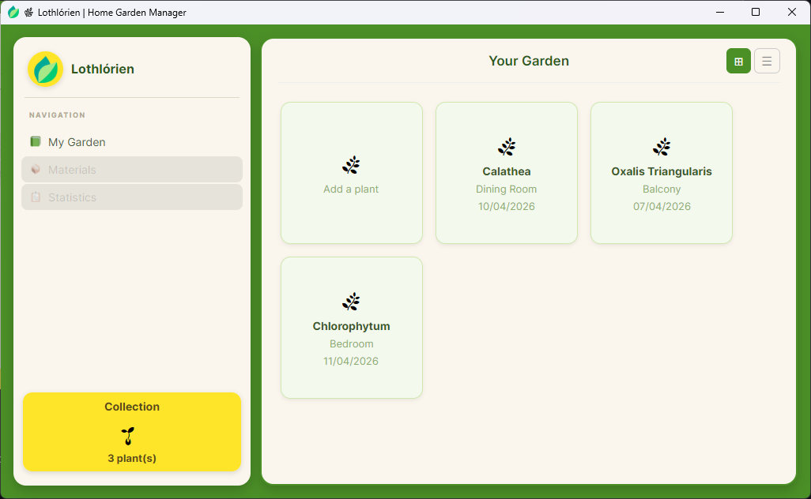
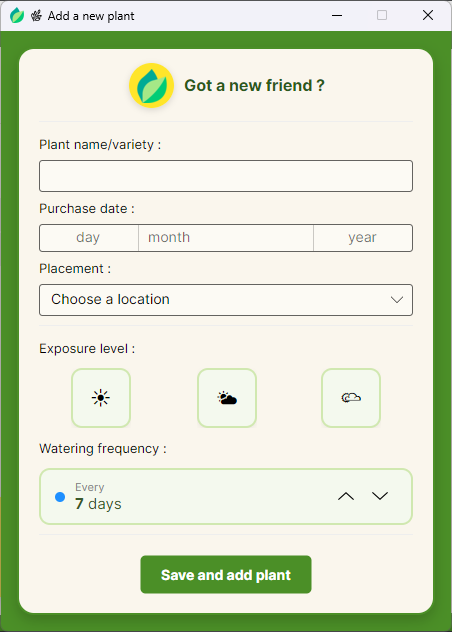
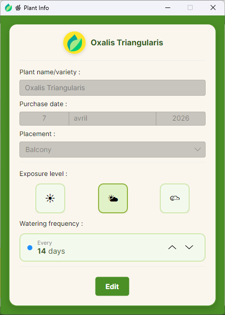

# 🌿 Lothlórien | Home Garden Manager

A desktop application built with **C#** and **Avalonia UI** to manage your own home garden.

## ✨ Features
### ✅ Available
- Add a plant to your garden (name, purchase date, location, exposure, watering frequency)
- View plant details by clicking on its card
- Edit plant information
- Card view with plant counter

### 🚧 Planned
- List view
- Material inventory management
- Plant watering & health tracking
- Statistics

## 🚀 How to Run

### Prerequisites
- [.NET 10 SDK](https://dotnet.microsoft.com/en-us/download) installed on your machine

### Steps
1. **Clone the repository** :
   `git clone https://github.com/maillet-nills/LothlorienGUI.git`
2. **Navigate to the project folder** :
   `cd LothlorienGUI`
3. **Open in your IDE** (Visual Studio, JetBrains Rider, or VS Code)
4. **Restore dependencies** :
   `dotnet restore`
5. **Run** : Use `dotnet run --project LothlorienGUI` or press `F5` in your IDE

## 🛠️ Technologies
- **C# / .NET 10** 🟦
- **Avalonia UI 11** (XAML) 🖼️
- **CommunityToolkit.Mvvm** (MVVM pattern)

## 📸 Screenshots

